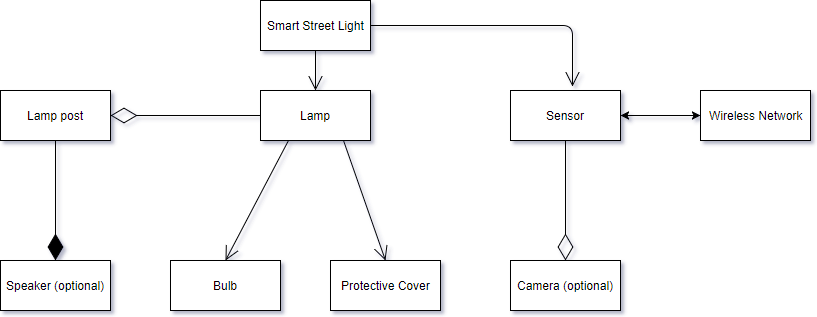

# Assignment1 - Practice Designing Models (Template)

> * Participant name: Jonathan A. Coad
> * Project Title: Working (Transportation)

## General Introduction

A **smart city** is an urban area that uses different types of electronic data collection sensors to supply information which is used to manage assets and resources efficiently.

When discussing smart cities, it is important to think about current standards and how we might be able to improve them. As of now, cities are responsible for using almost 80% of the world's energy output (Khatoun & Zeadally, 2016). As you can imagine, this is an alarming rate and has created a need to solve this potential energy crisis.

As we consider how to improve energy efficiency, technology such as machine learning and artificail intelligence should be harnessed. Common, every day inventions can be reimagined and used to create a much more eco-friendly environment. One example of this is street lights. A system already exists by the name of Telensa. This model uses a wireless network and a central management system to monitor the best time of day to brighten or dim based on real-time data. In addition, it also measures the amount of wattage that is being used for optimal efficiency. Altogether, this system helps establish a low-cost sensory network that improves day-to-day effectiveness.

A real-world example of this system is being developed and can be found here http://link.galegroup.com/apps/doc/A516740829/CDB?u=orla57816&sid=CDB&xid=06addeba. 
## References

Khatoun, R & Zealdally, S. (2016) Smart Cities: Concepts, Architectures, Research Opportunities. *Communications of the ACM* [serial online]. August 2016; 59(8). 46-57

Telensa. (2018). Smart cities start with intelligent street lighting. Retrieved from Telensa:www.telensa.com

## Requirements (Experimental Design)

An Ultra Narrow Band (UNB) network must be established and tested
Telecell lighting will be installed with sensors that monitor the environment
3rd party applications should be linked to connect within system (parking, transportation, etc)
People and technology must work together using software applications 

Cities waste energy with inefficient planning and lighting. Smart cities could analyze data and create a routine for optimal lighting within the city limits. By implementing smart street lights, energy usage and cost should reduce significantly.

By analyzing data sets about the weather, time of day, and public activities the sensors will receive invaluable inputs. Using these directions, the system will determine what functions to establish, such as an analysis of alternatives to simply turning on or off. This is done to identify the best approach at reaching a conclusion. Once decided upon, the system will automatically update and supplement the necessary outputs (adjusting the brightness, using a timer, etc).

Additional safety features are available upon request, including a video capturing device and a speaker with the capability of projecting or recording sound.

## Smart City (My Problem) Model
Below are representatives of how the models should operate

  The **Object Diagram ** provides the high level overview of components

  Whereas, the **Class Diagram ** provides details of how each component should work together

## Smart City (My Problem) Simulation

I found an article that helps to define how one might simulate this process.[**(Link here)**](analysis/StreetLightinginSmartCities.pdf) 

## Smart City (My Problem) Model
[**Code template**](code/README.md) - Starting coding framework for the (insert your exact problem here.)

## **P**ortable **O**rganic **T**rouble-free **S**elf-watering System (**POTS**) Model
Here [**we provide an overview**](code/POTS_system/README.md) of the **P**ortable **O**rganic **T**rouble-free **S**elf-watering System (**POTS**) 

